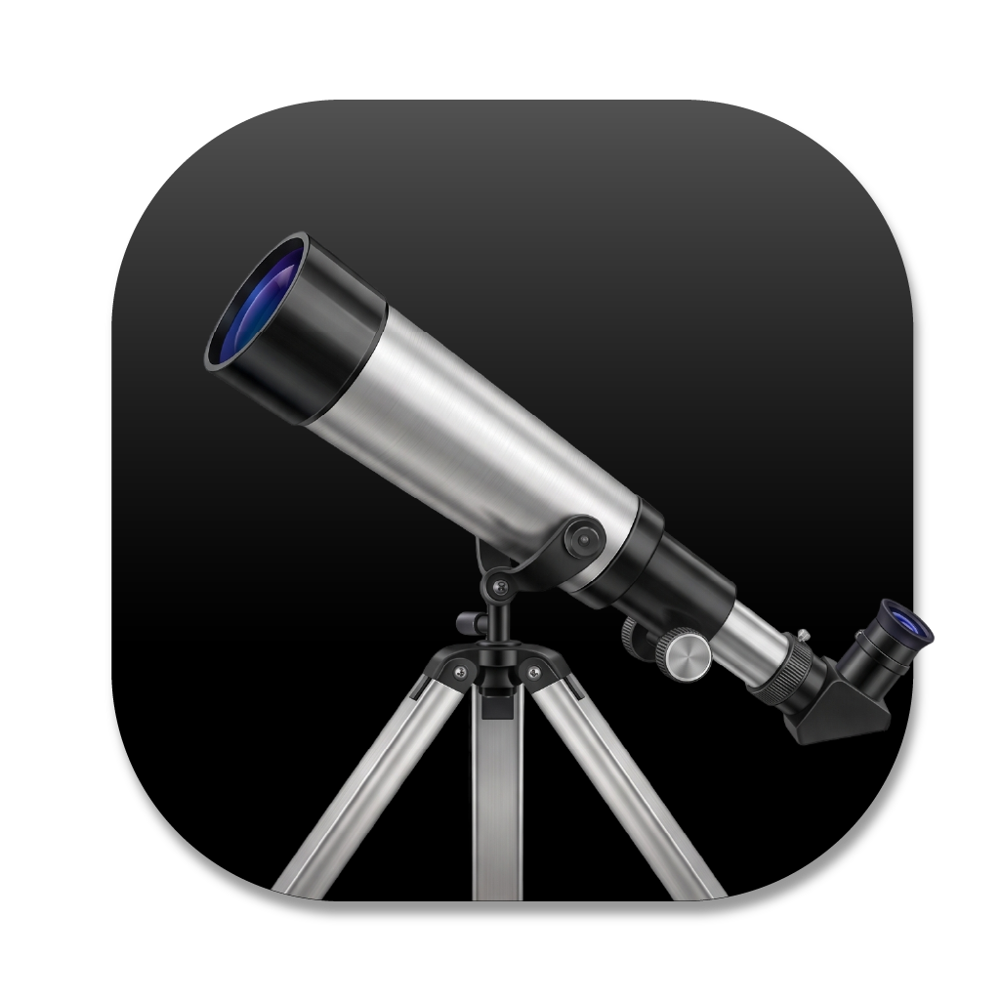

<div align="center">



# Dextr

**One workspace for every data source.**

A cross-platform desktop client for SQL, NoSQL, object storage, and HTTP APIs —
browse, edit, and query them all side by side.

[](#supported-platforms)
[](https://flutter.dev)
[](https://dart.dev)
[](https://github.com/JayashBhandary/dextr/releases)

[Install](#install) · [Data sources](#data-sources) · [Workspace](#workspace) · [Build](#build-locally) · [Release](#ci-build--release)

</div>

---

## Overview

A typical afternoon: you `psql` into one database, switch to a Mongo shell for
another, open a desktop client for MySQL, poke an S3 bucket in a browser tab,
and `curl` a REST endpoint to check a payload. Five tools, five mental models,
five places to fat-finger a production credential.

**Dextr collapses that into one tabbed workspace.** Connect to SQL, NoSQL, object
storage, or HTTP APIs side by side — browse containers, edit rows in a grid, run
raw queries, and inspect schemas, all the same way. Credentials live in the OS
keychain, not in your shell history.

> **Desktop only.** Dextr connects directly to databases over TCP sockets and via
> native SQLite (FFI), neither of which exist in a browser, so there is no web
> build. Mobile (Android / iOS) is not targeted.

## Data sources

| Source | Browse / edit | Raw query | Notes |
|--------|:---:|:---:|-------|
| SQLite | ✓ | SQL | local file, via FFI |
| PostgreSQL | ✓ | SQL | |
| MySQL | ✓ | SQL | |
| MongoDB | ✓ | query doc | |
| Firestore | ✓ | — | via REST, multi-project |
| S3 / MinIO | ✓ | — | hierarchical file browser, presigned URLs |
| REST API | ✓ | endpoint | saved operations |
| GraphQL API | ✓ | endpoint | saved operations |

Each connector advertises its capabilities — raw query, write, schema
read/mutate, transactions, object storage, file browse, endpoint invoke — and the
UI adapts to what the backend actually supports.

## Workspace

- **Connections sidebar** with secure credential storage (`flutter_secure_storage`).
- **Object tree** per connection — tables, collections, buckets, saved operations.
- **Browse pane** — paginated `pluto_grid` with inline insert / update / delete.
- **Query pane** — SQL editor with syntax highlighting for query-capable sources.
- **Schema pane** — columns, types, primary keys.
- **File browser** — upload / download / preview for object stores.
- **Tabbed** — multiple workspaces open at once.

## Supported platforms

| Platform | Architectures | Release artifact |
|----------|---------------|------------------|
| macOS    | universal (arm64 + x86_64), plus per-arch | `dextr-<version>-macos-{universal,arm64,x64}.dmg` |
| Windows  | x64 | `dextr-<version>-windows-x64.zip` |
| Linux    | x64 | `dextr-<version>-linux-x64.tar.gz` |

> Windows is x64 only — Flutter has no official Windows arm64 desktop target.

## Install

The install scripts pull the matching artifact from the latest GitHub Release and
install it for your platform.

**macOS / Linux** (requires `sudo`):

```bash
curl -fsSL https://raw.githubusercontent.com/JayashBhandary/dextr/main/install.sh | sh
```

**Windows** (PowerShell):

```powershell
irm https://raw.githubusercontent.com/JayashBhandary/dextr/main/install.ps1 | iex
```

| OS | Installs to |
|----|-------------|
| macOS | `/Applications/Dextr.app` (quarantine stripped — unsigned build) |
| Linux | `/opt/dextr`, symlink `/usr/local/bin/dextr`, desktop entry + icon |
| Windows | `%LOCALAPPDATA%\Programs\dextr`, Start Menu shortcut |

> Set `GITHUB_TOKEN` before running to avoid GitHub API rate limits.

## Build locally

Requires the Flutter SDK (`stable` channel, Dart `>= 3.12`).

```bash
flutter pub get

flutter build macos --release     # macOS universal
flutter build windows --release   # Windows x64
flutter build linux --release     # Linux x64
```

> No `build_runner` step — the project declares codegen dev-deps but does not
> use any `@freezed` / `@riverpod` / `@JsonSerializable` annotations yet.

### App icon

Launcher icons are generated from `assets/icon/icon.png`. Regenerate after
changing the source:

```bash
dart run flutter_launcher_icons
```

## CI: build & release

`.github/workflows/release.yml` builds macOS, Windows, and Linux and publishes a
GitHub Release.

- **Trigger:** `workflow_dispatch` only (Actions tab → *Release* → **Run workflow**).
- **Version:** read from the `version:` line in `pubspec.yaml`; the release is
  tagged `v<version>` (e.g. `0.1.0+1` → `v0.1.0`).

```bash
gh workflow run release.yml
```

Each job builds and uploads its artifact; the final `release` job attaches them
all to the `v<version>` tag with auto-generated notes.

> **Signing:** macOS artifacts are **unsigned** (ad-hoc codesigned after `lipo`
> thinning). For notarized distribution, add a Developer ID cert via repository
> secrets and the matching signing steps.

## Tech stack

| Concern | Library |
|---------|---------|
| UI framework | Flutter |
| State management | `flutter_riverpod` |
| Routing | `go_router` |
| Data grid | `pluto_grid` |
| Secure storage | `flutter_secure_storage` |
| Desktop window | `window_manager` |
| Drivers | `sqlite3`, `postgres`, `mysql_client`, `mongo_dart`, `minio`, `googleapis`, `dio`, `graphql` |

---

<div align="center">

Built with Flutter · macOS · Windows · Linux

</div>
